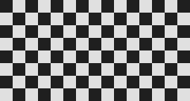
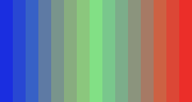

# Example catalog

Build the shared example plugin once by following the
[examples overview](index.md). Every page below assumes that module is loaded
under the `test` namespace; its Python snippet then exercises the filter being
explained. Registration is centralized in
[`EntryPoint.cxx`](https://github.com/PlaneSight/vapoursynth-plusplus/blob/master/examples/src/EntryPoint.cxx),
so the filter headers can focus on their data and scheduling contracts.

| Example | Demonstrates | Input contract | Scheduling |
| --- | --- | --- | --- |
| [GaussBlur](gauss-blur.md) | Read-only neighborhood access through `Plane::View` | Constant dimensions and format; single-precision float | One strict spatial frame |
| [GaussBlurFast](gauss-blur-fast.md) | Boundary-specialized loops and `DirectAccess` | Constant dimensions and format; single-precision float | One strict spatial frame |
| [Crop](crop.md) | Metadata changes and typed dispatch | Constant dimensions and format; 4:4:4 input | One strict spatial frame |
| [TemporalMedian](temporal-median.md) | Temporal windows and relative frame indexes | Constant dimensions and format; single-precision float | Radius window; no frame reuse |
| [MaskedMerge](masked-merge.md) | Acquiring three nodes with one typed workflow | Matching single-precision 4:4:4 clips and GrayS mask | Three strict spatial frames |
| [ModifyFrame](modify-frame.md) | Calling a `Function` from a filter | Constant dimensions and format | One strict spatial frame; parallel resource acquisition |
| [SeparableConvolution](separable-convolution.md) | Composing horizontal and vertical passes | Constant dimensions and format; single-precision float | Nested filter workflow |
| [Rec601ToRGB](rec601-to-rgb.md) | Format conversion and frame-property checks | YUV444PS, full range, Rec. 601 matrix | One strict spatial frame |
| [Palette](palette.md) | A source filter with generated metadata | Positive dimensions; non-empty shade list | No input dependency |

## Visual results

These images are generated by the [`tools/example_catalog`](https://github.com/PlaneSight/vapoursynth-plusplus/tree/master/tools/example_catalog) package. The harness constructs synthetic clips with VapourSynth, loads the built example plugin, requests real output frames, and writes deterministic PNGs. CI regenerates the pixels and rejects stale assets.

### Palette

`Palette` is a source, so there is no input frame. The comparison shows two frames selected from the generated five-frame clip.

| First generated frame | Last generated frame |
| --- | --- |
|  |  |

### GaussBlur

| Before | After |
| --- | --- |
|  |  |

### GaussBlurFast

| Before | After |
| --- | --- |
|  |  |

The two implementations agree throughout the image interior. Their one-pixel border differs because `GaussBlur` uses the library's remapped view while `GaussBlurFast` spells out clamped edge loops; the generator checks only the shared interior contract.

### Crop

| Before: 240 × 128 | After: 192 × 96 |
| --- | --- |
|  |  |

### TemporalMedian

| Before: noisy centre frame | After: radius-one median |
| --- | --- |
|  |  |

The three-frame input is `normal, inverted, normal`; selecting the per-pixel median restores the centre frame to the repeated neighbours.

### MaskedMerge

| Before: background | After: masked foreground blend |
| --- | --- |
|  |  |

### ModifyFrame

| Before | After: callback result |
| --- | --- |
|  |  |

### SeparableConvolution

| Before | After: horizontal and vertical passes |
| --- | --- |
|  |  |

### Rec601ToRGB

| Before: false-color Y, Cb, Cr planes | After: RGB interpretation |
| --- | --- |
|  |  |

The left image maps Y, Cb + 0.5, and Cr + 0.5 into display channels so the stored planes are visible; it is not an RGB interpretation of the YUV frame. The generator independently calculates the Rec. 601 reference colors and checks the plugin output sample-for-sample.

## Reading the examples

Each filter makes its assumptions executable in the constructor. The useful questions to ask
while reading are:

- What metadata does the filter promise?
- Which exact input frames does it request?
- Is each input frame read-only?
- How are borders or out-of-range temporal indexes handled?
- Which properties are copied or rewritten?
- Which resource owns each API handle after the callback returns?

These questions are also the checklist for a new filter.

Each linked page includes annotated code, a runnable VapourSynth call, the
filter's invariants, and a focused extension exercise. The source link on each
page remains the authority if an example changes between documentation
releases.
