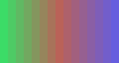
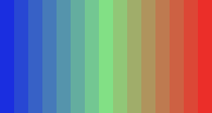

# Rec601ToRGB format conversion

`Rec601ToRGB` is a metadata-sensitive filter. Pixel type and dimensions are not enough: the `_Matrix` and `_ColorRange` frame properties determine what the stored YUV samples mean.

[View `Rec601ToRGB.hxx` on GitHub](https://github.com/PlaneSight/vapoursynth-plusplus/blob/master/examples/src/Rec601ToRGB.hxx)

## Before and after

| Stored Y, Cb, Cr values | Converted RGB output |
| --- | --- |
|  |  |

The left image is a false-color diagnostic: Y, Cb + 0.5, and Cr + 0.5 are mapped to display channels so all three stored planes are visible. It is not an RGB interpretation of the input. The generator independently converts the same reference colors to YUV and checks the plugin's RGB output sample-for-sample.

## Validate the structural format

```cpp
field(InputClip, VideoNode{});

static constexpr auto Signature = "clip: vnode";

Rec601ToRGB(auto Arguments) {
    InputClip = Arguments["clip"];
    if (!InputClip.WithConstantFormat() ||
        !InputClip.WithConstantDimensions() ||
        !InputClip.IsSinglePrecision() ||
        !InputClip.IsYUV() || !InputClip.Is444())
        throw std::runtime_error{ "only YUV444PS clips supported." };
}

auto SpecifyMetadata(auto Core) {
    auto Metadata = InputClip.ExtractMetadata();
    Metadata.Format = Core.Query(VideoFormats::RGBS);
    return Metadata;
}

auto SpecifyDependencies() const {
    return std::array{
        InputClip.SpecifyDependency(rpStrictSpatial)
    };
}
```

The output preserves dimensions, timing, and frame count while changing the declared format to planar floating-point RGB.

## Check semantic properties and convert

```cpp
auto GenerateFrame(auto Index, auto GeneratorContext, auto Core) {
    auto InputFrame =
        InputClip.AcquireFrame<const float>(Index, GeneratorContext);
    auto ProcessedFrame = VideoFrame<float>{
        Core.AllocateVideoFrame(
            VideoFormats::RGBS, InputClip.Width, InputClip.Height)
    };

    if (!InputFrame["_Matrix"].Exists())
        Core.Alert("_Matrix property not found, assuming Rec601.");
    else if (auto Matrix = static_cast<int>(InputFrame["_Matrix"]);
             Matrix != 6)
        throw std::runtime_error{ "unrecognized _Matrix!" };

    if (!InputFrame["_ColorRange"].Exists())
        Core.Alert(
            "_ColorRange property not found, assuming full range.");
    else if (auto ColorRange =
                 static_cast<int>(InputFrame["_ColorRange"]);
             ColorRange != 0)
        throw std::runtime_error{ "only full range supported!" };

    for (auto y : Range{ InputClip.Height })
        for (auto x : Range{ InputClip.Width }) {
            auto Kr = 0.299, Kg = 0.587, Kb = 0.114;
            auto Y = InputFrame[0][y][x];
            auto Cb = 2 * InputFrame[1][y][x];
            auto Cr = 2 * InputFrame[2][y][x];
            ProcessedFrame[0][y][x] = Y + (1 - Kr) * Cr;
            ProcessedFrame[1][y][x] =
                Y - (1 - Kb) * Kb / Kg * Cb -
                (1 - Kr) * Kr / Kg * Cr;
            ProcessedFrame[2][y][x] = Y + (1 - Kb) * Cb;
        }

    ProcessedFrame.AbsorbPropertiesFrom(InputFrame);
    ProcessedFrame["_Matrix"] = 0;
    ProcessedFrame["_ColorSpace"] = 0;
    return ProcessedFrame;
}
```

Missing properties produce warnings and documented assumptions. Contradictory properties fail rather than silently applying the wrong coefficients. After copying other useful properties, the filter rewrites the color interpretation for RGB output.

```python
yuv = core.std.BlankClip(format=vs.YUV444PS)
yuv = core.std.SetFrameProps(yuv, _Matrix=6, _ColorRange=0)
rgb = core.test.Rec601ToRGB(yuv)
```

!!! warning "Educational scope"
    This example handles one matrix, full range, 4:4:4 sampling, and floating-point samples. General color conversion also needs transfer characteristics, primaries, chroma location, range scaling, and numerical-policy decisions. Use a production color-management filter when those cases matter.
